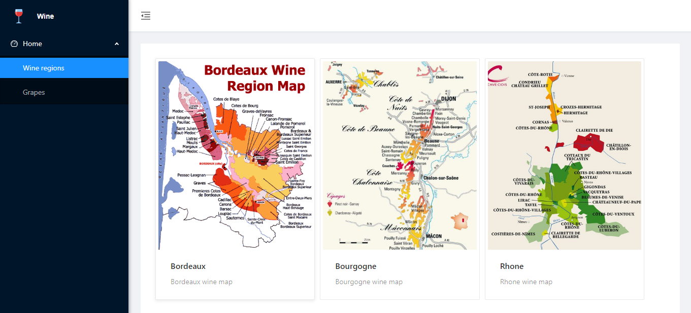
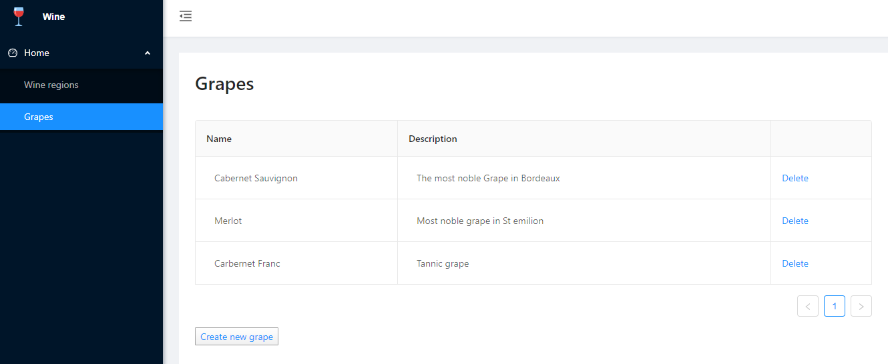
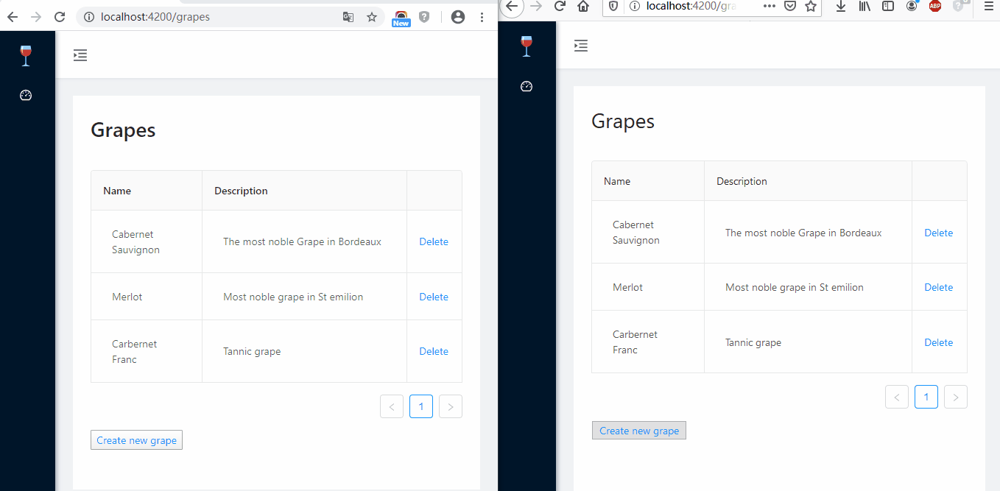
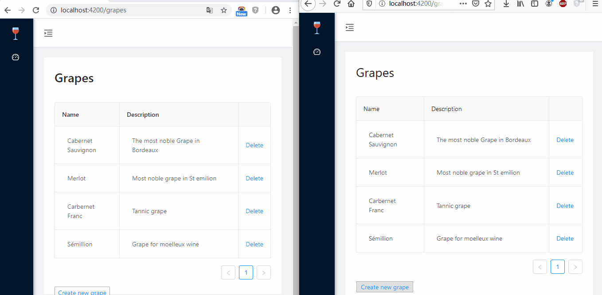

# French Wine Explorer

**French Wine Explorer** is an web application with:

* an **ASP.NET Core Web API**
  * SignalR
  * .NET Core 3.1
  * Entity Framework Core
  * Unit of Work
  * Generic Repository
  * Ioc Unity Container
* an **Angular 9 UI**

 

## **UI**

### Wine regions

### Grapes

## **Grapes Demo with SignalR**

### **Add Grape**

### Delete Grape

